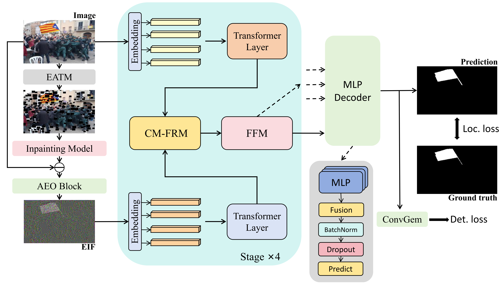

# EARG-Net: Edge-Aware Reconstruction-Guided Network for Image Manipulation Detection and Localization (AAAI2026）
## 📰Abstract
Recent advances in image editing tools, particularly those used in content-aware retouching and object-level manipulation, have raised significant concerns regarding the authenticity of digital images. While many Image Manipulation Detection and Localization (IMDL) methods have been proposed, they often struggle with subtle forgeries, intricate boundary artifacts, and manipulations generated by unseen editing techniques. In this work, we propose a novel edge-aware framework that leverages the strong natural image priors of pre-trained inpainting models to harmonize manipulated regions. By guiding the inpainting process with generated edge-aware masks, our method reconstructs tampered areas using surrounding context, yielding perceptually coherent results. The pixel-wise residual between the original and reconstructed images reveals manipulation-sensitive inconsistencies—particularly around editing boundaries—thereby enabling accurate and generalizable detection and localization. Extensive experiments across multiple benchmarks demonstrate that our approach achieves state-of-the-art performance, especially in challenging scenarios involving realistic and finely retouched image forgeries.
## 🔍Overview

## ⚡Train and Test
For dataset and model utilization, we recommend using [IMDLBenCo](https://github.com/scu-zjz/IMDLBenCo), which offers many methods. And you can use this codebase to load the data and test model.
- Before starting training or testing, the environment needs to be prepared.
```bash
cd workspace
conda env create -f environment.yaml
conda activate earg
```
- Next, we need to modify the path of the pre-trained model and dataset json.
- Train
```bash
sh train.sh
```
- Test
```bash
sh test.sh
```
## 📖Citation
```
@article{article,
author = {Yu, Yanpu and Shi, Zhaoxin and Hanqing, Zhao and Wei, Tianyi and Zhou, Wenbo and Yu, Nenghai},
year = {2026},
month = {03},
pages = {12178-12186},
title = {EARG-Net: Edge-Aware Reconstruction-Guided Network for Image Manipulation Detection and Localization},
volume = {40},
journal = {Proceedings of the AAAI Conference on Artificial Intelligence},
doi = {10.1609/aaai.v40i14.38208}
}
```
If you find our work interesting or helpful, please don't hesitate to give us a star🌟 and cite our paper! Your support truly encourages us!

## 🙇‍References & Acknowledgements
We sincerely thank [IMDLBenCo](https://github.com/scu-zjz/IMDLBenCo) for their exploration and support.
